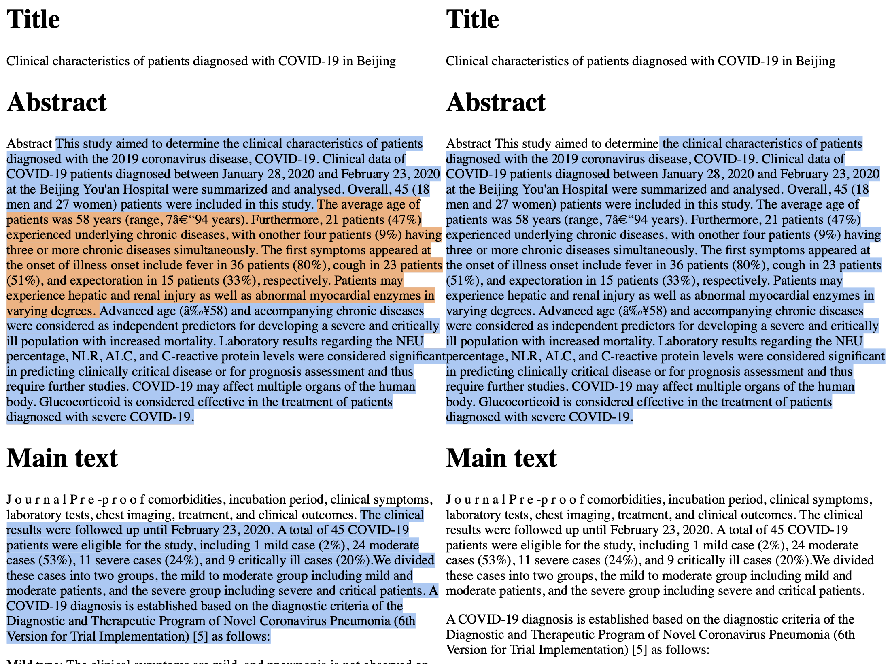

# redasa-sample-data
Contains a sample of data provided by the PANSURG REDASA project

### Loading data
- `load_curataions` function in `main.py` can be used to load all of the curations into a `pandas.DataFrame`
- `get_annotation_spans` function in `main.py` can be used to get information about annotated textual spans.
- See `example.ipynd` for dataframes

### Curator annotations
- contained in the `data/annotations` directory
- each file represents a single curation for a given document 
- file format: `i_j.json`
  - `i` represents document ID
  - `j` represents curator ID

### Documents
- contained in the `data/documents` directory
- file format: `i.json`
  - `i` represents document ID

### Textual annotations visualised
- `data/visualisation` directory contains `.html` files for documents with curator annotated textual spans highlighted 
- Example is show below

  
  
  # Citations

  [](https://doi.org/10.5281/zenodo.4467900)
  
  ## Cite as
    
    `PanSurg Consortium. (2020, October). REDASA Sample Data (Version v0.1). Zenodo. http://doi.org/10.5281/zenodo.4467900`

  ## Bibtex
  
  ```bibtex
  @software{redasa-sample-data-v0.1,
    author       = {PanSurg Consortium},
    title        = {REDASA Sample Data},
    month        = oct,
    year         = 2020,
    publisher    = {Zenodo},
    version      = {v0.1},
    doi          = {10.5281/zenodo.4467900},
    url          = {https://doi.org/10.5281/zenodo.4467900}
  }
```
